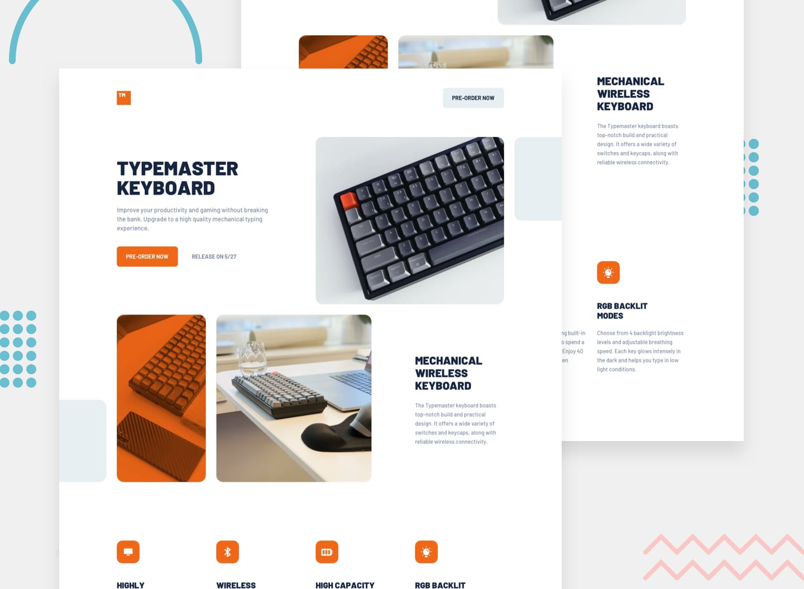

# ReadME Documentation


<div align="center">
  

  <h2 align="center">Typemaster Keyboard - A Landing Page </h2>

  A fully responsive keyboard landing page <br />Responsive for all devices, build using HTML, CSS, and JavaScript.

  <a href="https://keyboard-typemaster.netlify.app/"><strong>➥ Live Demo</strong></a>

</div>

<br />


### Demo Screenshots



Typemaster Keyboard Demo

### Prerequisites

Before you begin, ensure you have met the following requirements:

- [Git](https://git-scm.com/downloads) must be installed in your operating system

### Run Locally

To run **typemaster keyboard** locally run this command on your git bash: 

Linux and MacOs:

```bash
sudo git clone https://github.com/salutDami/typemaster-landing-page.git
```

Windows: 

```bash
git clone https://github.com/salutDami/typemaster-landing-page.git
```

### Contact

If you want to contact me you can reach me at [Twitter](https://twitter.com/_TraverseDOM) or [LinkedIn](https://www.linkedin.com/in/ikuomola-stephen/)

### License

This project is **free to use** and does not contain any license.