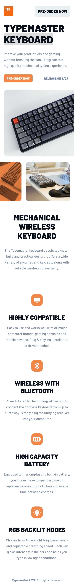
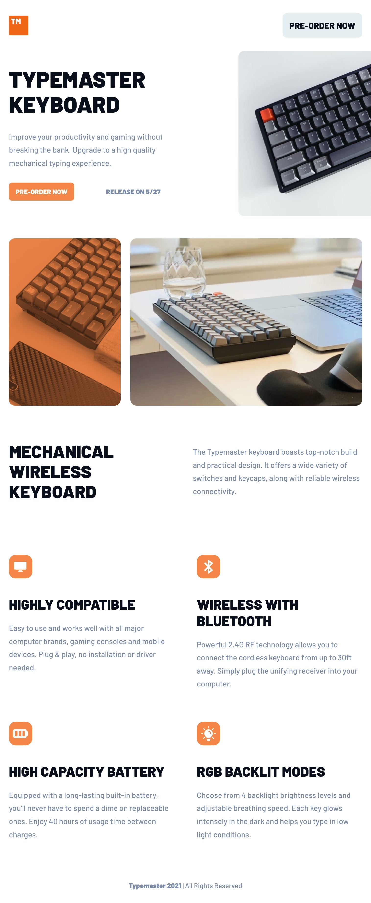
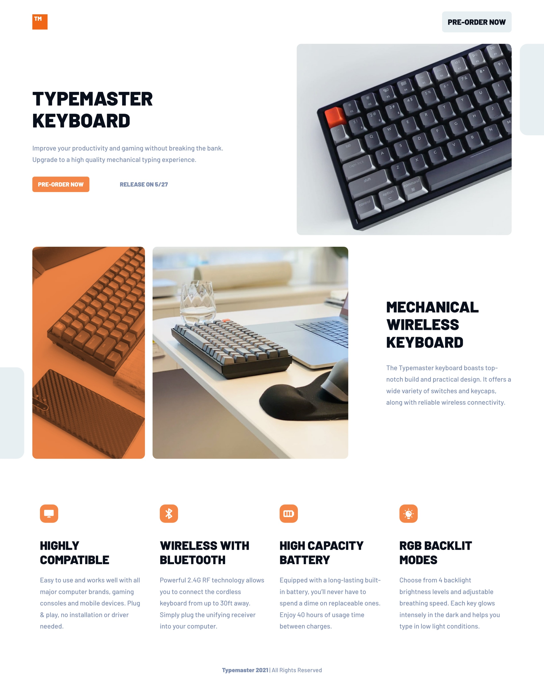

# Project Documentation

## Table Of Content

- **Overview**
    - User Stories
    - Features
    - Screenshots
- **Process**
    - Tools Used
    - Learning Curves
    - Continued Development
    - Resources
- **Author**
- **Acknowledgment**

## Overview

### User Stories

The user/users of the website would be able to 

1. View the website across different devices. 
2. See different hover states. 

### Features

1. Animations when scrolling across the page
2. Buttons showing different states on hover 
3. An svg image/background when on desktop but not on mobile. 

### Screenshots

Here are the screenshots of this project showing how the website looks on the desktop, mobile and tablet showing how responsive it is



Mobile View 



Tablet View 



Desktop View 

## Process

### Tools Used/Built With

This project was built using:

- Semantic HTML5 Markup
- CSS custom properties
- Flexbox
- Mobile-first workflow
- JavaScript

### Learning Curves

Overall this was a good process for me because I got to learn some new things and also re-learn some of the concepts I thought I already new but was not really clear enough. 

**Working with Flexbox** 

This project was build using majorly CSS flexbox for the layouts and I got to have a deep dive to how really flexbox works in terms of creating new formatting context for its children element and how the children adjust to the container to fit inside of it. 

For example: When implementing style for the layout of the **`hero`** section in the code. I had to use the the CSS **`flex-wrap`** property and set it `**wrap**` since I was working with a mobile first approach. This would make for the flex-items in the flex container to easily adjust as the width of the browser/viewport changes.

```css
.hero-flex__property {
	display: flex; 
	flex-wrap: wrap; 
	gap: 30px; 
}
```

While I do realise that I could have done something like this: 

```css
.hero-flex__property {
	display:flex; 
	flex-direction: column; 
	gap: 30px; 
}

/* This also works */
```

I wanted to make the flexible boxes adjust themselves when there was space available and when they don’t adjust I could then use the **`flex-basis`** which works the same if you use **`width`** as long as the direction is set to row (set to this by default).  At a certain media query maybe about a minimum of **768px** for tablet I can do this on the children of the parent **`.hero-flex__property`**

```css
.hero_content, .images{
    flex-basis:40%; 
    flex-grow:1; 
  }

/* In the case making each flex-item have this flex-basis property and they 
		
	 do not fill the space then the flex-grow property would make the items to

	 grow. In this case but items grow at the saame rate and they are set to 1.

*/
```

**Implementing The Square Pattern svg**

This was done by using the concept of how positioning elements on the page and how stacking context works. This was done by making the the image/svg (square pattern) as a child of the **`hero` section** element and this technique also applies to the **`about`** section element. Both elements had to be the parent/ancestor elements of the image /svg (square pattern) elements  . The reason for this was because if that image element was set to have a **`position`** of **`absolute`** it would mean that the elements containing block would depend on what the nearest ancestor element has a positioning property which is not static. See explanation: 

- If an element has a **`postion: absolute`** , it’s containing block if formed at the padding block of the nearest element ancestor whose **`position`** is **`relative`** or `**absolute`** and is not **`static`**

This then means that the if I make the hero section have a **`postion:relative`** the image would be relative to the hero section since its **`position`** is set set to **`absolute`** 

```css
/* All this was done when the browser viewport is above 1300px and above in a media query  */

.hero,
.about {
   position: relative; 
}

.square_pattern-1, .square_pattern-2 {
    display: block;
    position: absolute; 
    z-index: 3; 
  }

  .square_pattern-1 {
    top:0; 
    right:0; 
    transform: translateX(75%); 
  }

  .square_pattern-2 {
    left: 0; 
    bottom: 0; 
    transform: translateX(-75%); 
  }

/* Use the transform property to move the image along the desired direction */

/* To top, left, right and bottom to position the element relative to the nearest ancestor */
```

After this was done I noticed the svg image was overlapping the **`container`** which was a sibling to the square pattern image in the structure. This was because the square pattern had a higher stacking context than the container. I had to make the container have a **`position:relative`** and set the **`z-index`** to be more than the square pattern image. 

```css

.hero,
.about {
   position: relative; 
}

.square_pattern-1, .square_pattern-2 {
    display: block;
    position: absolute; 
    z-index: 3; 
  }

  .square_pattern-1 {
    top:0; 
    right:0; 
    transform: translateX(75%); 
  }

  .square_pattern-2 {
    left: 0; 
    bottom: 0; 
    transform: translateX(-75%); 
  
	}

	.container{
	    max-width:130rem;
	    margin-inline:auto;
	    padding-inline:var(--space-5);
	    position: relative; 
	    z-index: 4; 
	  }

```

**Revealing the Elements on Scroll**

I use a bit of JavaScript for this project to implement a small animation to reveal the elements on scroll when it meets a certain a certain point in the viewport and this was done using the **Intersection Observer** API. The API, is used to asynchronously observe chnages in the intersection of a target element with an ancestor element or with a top level document’s viewport. 

The API just takes in a `**callback function**` and an **`option`** which will be used to control the circumstance of when the callback function is invoked. A target element must be specified because we would need to tell our observer to watch the target and also we want to know that the target element has intersected the viewport or the target element’s ancestor element/parent.  

- The first step to do when working with this API is to define what the target element is which in this case is the sections element which we get from the DOM. This is because  because we would need to check for when each section meets a criteria in the viewport.

```jsx
const sectionsElements = document.querySelectorAll('.section'); 

```

- The second step would be to define the observer and the call the **`IntersectionObserver`** constructor with the **`new`** keyword by passing a callback function and an object of options.

```jsx
let observer = new IntersectionObserver(handleIntersection, ObserverOptions); 
```

- The **`ObserverOptions`** and the **`handleIntersection`** function should now be defined

```jsx
const ObserverOptions = {
	root: null, 
	rootMargin: "Opx", 
	threshold: 0.25,
}; 

const handleIntersection = function(entries, observer) {
	entries.forEach(function(entry) {
		if (entry.isIntersecting) {
				entry.target.classList.remove('section__hidden'); 
				observer.unobserve(entry.target)
		}; 
	}); 
}; 

let observer = new IntersectionObserver(handleIntersection, ObserverOptions);

sectionsElements.forEach(function(section) {
	section.classList.add('section__hidden'); 
	observer.observe(section); 
}); 
```

The root can be null or an element which must be the parent of the target. This root is the element that the target element will intersect with. 

To observe this target element we need to loop over the section elements which we selected from the DOM using **`querySelectorAll()`** and add the **`section__hidden`** class to hide the section elements. Then we observe each section element

The rootMargin specifes the margin around the root. The values offset each side of the root element. Its like applying the normal CSS margin property to elements. 

The thresold specifies the percentage at the target element is visible. This is the degree to which the target will intersect the viewport in this case there by making the callback function called.

This handleIntersection function takes in two parameters, the entries paramter which is a array containing list of entries one entry for each target which has intersected the root. The second paramter is the observer which I used to stop the observer from watch the target. 

How do we know if the target is intersecting? 

Each entry which is an object has access to properties like **`isIntersecting`** , **`target`, `boundingClientRect`,** etc. I was able to see all this by logging entry to the console. To know if the target element was intersecting, I need to check what the isIntersecting value is with each scroll. Checking console,  the values change from true to false and vice versa. I can then check to see if it intersecting. If it is intersecting we can then we can remove the class on the target element with a class of **`section__hidden`** to give the animation effect on the page**.** This class was defined in the CSS code. 

```css
.section {
  transition-property: opacity, transform;
  transition-duration: 1s, 2s;
  transition-timing-function: ease-out;
}

.section__hidden {
  opacity: 0 ; 
  transform: translateY(80px); 
}
```

Finally we need to stop the observer from watching the target bacause the intersction happens when we scroll up and down. So we want to stop watching after the initial intersection when scroll through each section down the page. 

### Continued Development

I want to keep working on more projects to improve my skills and also improve my understanding of more HTML, CSS and JavaScript concepts. I also came across a problem when working with the media query. I never knew that the **`device-width`** property is actually deprecated and some browsers no longer support it. When testing it across different browsers it was working fine with Google Chrome, Firefox and Microsoft Edge but Safari was totally not supporting it so its best to avoid. 

### Resources

Here are some useful resources I used for this propject: 

[MDN(The Stacking Context)](https://developer.mozilla.org/en-US/docs/Web/CSS/CSS_Positioning/Understanding_z_index/The_stacking_context) - The link was really helpful in helping me understand stacking context and how it works in CSS positioning 

[MDN(Layout block and containing block)](https://developer.mozilla.org/en-US/docs/Web/CSS/Containing_block) - If you do wish to know more about positioning and how it works. 

[Flexbox](https://www.joshwcomeau.com/css/interactive-guide-to-flexbox/) - [Josh Comeau](https://www.joshwcomeau.com/) really did some good justice to CSS flexbox in this article, he has a very good way of explaining thing and also some good visual representation of how flex-box works in terms of the flex container and the flex items. I can assure you your knowledge of flex box will be improved after reading this. 

[MDN(Intersection Observer API)](https://developer.mozilla.org/en-US/docs/Web/API/Intersection_Observer_API) - MDN has a very good documentation of how to get started with this API with some good examples of how it works. 

[w3schools](https://www.w3schools.com/css/css3_transitions.asp) - This was a good resource to work with when learning how to use the CSS transition property. 

### Acknowledgement

This was an interesting project which I did building with some help of some helpful resources so I would like to thank the people out there who made thes resources available for free to be used. Its a marathon to be becoming a Frontend Webdeveloper first and then Fullstack eventually but I will there with my hardwork.